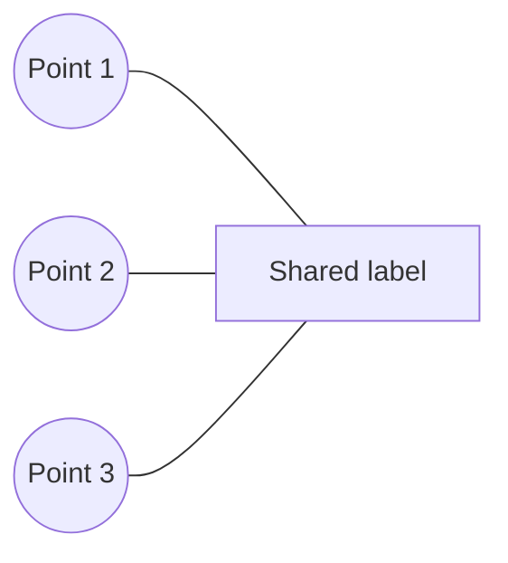

# ArcGIS Pro Cartography Add-ins

**Portfolio report | Personal project | September 29, 2026**

Two independent C# desktop extensions that address specific cartographic editing tasks inside ArcGIS Pro. Multiple Leaders creates editable shared-label graphics for selected point features. Legend Scaler applies a percentage transform to supported properties of a live layout legend.

## Portfolio snapshot

| Component | Version | Delivered capability |
| --- | --- | --- |
| Multiple Leaders | 0.1.4 | Create, reconnect, move, and resize a shared-label graphic with native leader lines. |
| Legend Scaler | 0.1.2 | Resize supported legend contents and frame; modify the original or create a live copy. |
| Delivery | Windows / Pro 3.7 | Independent solutions, checks, build scripts, and installable .esriAddinX packages. |

## Portfolio card copy

Built two ArcGIS Pro add-ins in C# and .NET: a tool that connects one editable text graphic to multiple point features, and a tool that resizes supported properties of live layout legends. The project combines WPF interfaces, native CIM graphics, source identity checks, cancellation handling, and ArcGIS Pro integration. Selected workflows were validated in a synthetic ArcGIS Pro test project.

## Case-study introduction

Cartographic editing often involves repetitive adjustments that are difficult to package into a clear, reversible workflow. This personal project turns two focused ideas into independent ArcGIS Pro extensions. Multiple Leaders lets a user place a shared label, reconnect it after source points move, and adjust its position or size. Legend Scaler exposes percentage-based resizing for supported legend properties. Development included iterative native testing, which uncovered behavior that compilation and standalone checks alone could not establish.

## Ownership and maturity

Personal project developed with AI-assisted coding and iterative user-directed requirements and testing. The implemented outcome is working prototype software with bounded verification. Production deployment, user adoption, time savings, and performance gains have not been measured or established.

**Portfolio emphasis:** geospatial software engineering, desktop interaction design, native GIS integration, coordinate-system handling, and evidence-based validation.

<!-- pagebreak -->

# Multiple Leaders

**One shared-label graphic connected to several point features.**

## Problem and workflow

Some maps need one description associated with several nearby features. This add-in provides a manually placed shared text graphic, with native leader lines connecting it to selected source points.

1. Select 2-100 point features in one layer, including at least two distinct locations.
2. Enter text, or use a common nonblank value from a string field.
3. Choose font size and leader width, then click the desired label position.
4. Select the resulting graphic to reconnect its leaders, move it, or resize its text.

*Conceptual diagram: three invented point locations connected to one shared label. This is a workflow illustration, not an ArcGIS Pro screenshot.*

## Implemented capabilities

- One native CIMTextGraphic with a CIMLeaderPoint for each distinct point location. Coincident source points share a visible endpoint.
- Font size of 6-72 points, leader width of 0.1-5 points, and literal text handling for special characters.
- Reconnect Leaders re-reads the original feature IDs after points move, preserving the label position, text, and styling.
- Move Label changes the text position and rebuilds leaders to the original source features. Resize Label changes font size while preserving position, endpoints, and leader width.
- Explicit cancellation and a return to idle after placement; results can be hidden through the graphics-layer visibility control.

## Documented native results

Creation, shared-field lookup, three visible leaders, placement exit, cancellation, and layer visibility passed selected tests in version 0.1.3. Version 0.1.4 then passed reconnecting an existing label after a source point moved, resizing from 12 to 18 points, and moving the text to a clicked location. Move and resize each passed single-step Undo/Redo; Escape canceled a pending move. Saved CIM retained the tested text, font size, leader width, and three source endpoints.

## Scope boundaries

This is a manual graphics workflow. Automatic clustering, collision avoidance, scale-dependent regrouping, and feature-linked annotation are outside its scope. It supports point feature layers in 2D maps. Reconnection does not update text previously copied from a field. Projection between different geographic coordinate systems is rejected; Move additionally requires matching map and graphics-layer coordinate systems. Source membership cannot be edited in place.

<!-- pagebreak -->

# Legend Scaler

**Percentage-based resizing of supported live-legend properties.**

## Problem and workflow

A layout legend contains more than a frame: text, gaps, patches, indents, and fitting behavior all affect the result. Legend Scaler exposes a percentage operation that transforms supported sizes while retaining the live legend's map connection.

1. Select one unlocked, unrotated legend outside a group in a layout.
2. Open Legend Tools > Resize Legend and enter a percentage from 10 to 1,000.
3. Create a scaled live copy, or scale the original with a native undo operation.
4. Inspect the result and any reported style or overflow limitations.

## Implemented capabilities

- Scales explicit font sizes, gaps, patches, item indents, and the frame around its existing anchor.
- Transforms supported text halos, frame borders, shadows, and simple effects present in the legend definition.
- Clones the legend definition to retain non-size settings and supports a separate live copy for comparison.
- Uses Adjust columns fitting with automatic font sizing disabled, and retains the original state for restoration.
- Provides percentage input, projected frame dimensions, selection checks, warnings, and cancellation-aware edit handling.

The underlying datasets, map renderers, and map labels are not edited. Scaling is relative to the current legend: applying 125% twice produces 156.25% of the starting configured size.

## Documented native results

Version 0.1.2 was tested with a synthetic layout legend in ArcGIS Pro 3.7.2.

| Native action | Observed frame dimensions |
| --- | --- |
| Initial legend | 5.5 x 4.25 layout units |
| Scale original to 125% | 6.875 x 5.313 layout units, as rounded in the dialog |
| Ctrl+Z and reinspect | 5.5 x 4.25 layout units restored |

Close, Escape, and the title-bar close control also closed the idle dialog. These observations verify the tested frame transformation and Undo behavior.

## Scope boundaries

Full proportional rendering of every visible legend component is not established. Point symbols and line strokes inherited from map renderers may retain their original sizes even when legend patches grow. Complex styles and previously auto-shrunk text require further qualification. Copy creation is implemented but still awaits native acceptance testing. Rendering can reflow columns, and a copied legend can extend outside the page.

<!-- pagebreak -->

# Engineering and validation

**C# / .NET 10 / WPF / ArcGIS Pro SDK 3.7 / CIM / PowerShell**

## Architecture

Ribbon commands and WPF dialogs collect user intent. Service code performs map and layout edits on Pro's main worker thread through QueuedTask. CIM builders and transformation code handle graphic construction and legend properties. Each add-in has an independent solution, standalone check harness, and build script.

## Engineering decisions worth highlighting

- **Source identity:** shared labels store the source layer URI, ObjectIDs, a hash of the data connection, and creation metadata. Reconnection uses captured membership rather than the current feature selection, and refuses missing members or a changed connection. Replacing a dataset at the same connection while reusing ObjectIDs remains a limitation.
- **Interaction lifecycle:** native testing exposed placement tools that could remain active after cancellation. Tool transitions were deferred until MapTool callbacks completed, with request-state checks and a scoped Escape handler for sketch-tip focus. Selected exit paths were then retested in Pro.
- **Native positioning:** changing the graphic's CIM Shape did not move native point text in the tested host. The implementation now uses SetAnchorPoint, rebuilds leaders, checks the resulting position, and attempts restoration if a mutation fails.
- **Reproducible packaging:** build scripts use locally installed Pro assemblies, validate DAML, run checks, and produce .esriAddinX installers without redistributing Esri runtime DLLs. A previous installer is replaced only after the build and checks succeed.

## Evidence summary

| Evidence class | Recorded result | What it establishes |
| --- | --- | --- |
| Local builds | Both Release builds: zero warnings and errors | Compatibility with the tested local build environment. |
| Standalone checks | 17 Legend Scaler + 21 Multiple Leaders | 38 checks across CIM handling, validation, and interaction-state logic; not native rendering coverage. |
| Schema and packages | Both DAML files validated; package contents checked | Ribbon schema and intended installer contents. |
| Native tests | Selected synthetic workflows passed | The specific behaviors described on the preceding pages. |
| Loaded-code verification | Installed and cached DLL versions and hashes checked | Native tests used the intended add-in builds. |

The validation record is dated September 29, 2026, using ArcGIS Pro 3.7.2 and .NET SDK 10.0.204 on Windows. Report preparation reviewed repository evidence and source; it did not rerun the native tests. These are local results, not CI, marketplace certification, or a production qualification.

<!-- pagebreak -->

# Portfolio handoff

**Use the portfolio card copy and introduction as the public-facing foundation.**

## Positioning and publication rules

Present one project, **ArcGIS Pro Cartography Add-ins**, with Multiple Leaders as the lead feature and Legend Scaler as a companion tool. Use the existing portfolio's software engineering or GIS development category. Keep the prototype status visible.

- Publish concrete capabilities and the bounded test observations. Describe the intended benefit as fewer manual cartographic adjustments; do not state measured productivity gains.
- Keep the source repository private. Do not add a public repository button or download link without a deliberately published destination. Packages are unsigned prototypes requiring a compatible ArcGIS Pro installation.
- Use synthetic demonstrations and clearly labeled diagrams. Do not publish local QA files, account details, absolute machine paths, employer data, or raw application logs.
- Avoid claims of automatic labeling, Maplex extensions, universal proportional legend scaling, production adoption, or fully qualified Undo/persistence behavior.

## Outstanding qualification

Legend Scaler still needs native coverage for copy creation, queued/running cancellation, richer styles, and complete font/fitting/anchor restoration and Redo. Multiple Leaders still needs broader native coverage for interrupted edits, projection differences, duplicate clicks, special-character rendering, and complete source-metadata restoration. Creation exposed separate Undo entries; single-step creation Undo and reconnect Undo are not established. Broader save/reopen and exported-map PDF behavior remain unqualified for both add-ins.

## Evidence map

The source snapshot is commit **202ff3ed60454f0359604061cd40786ca67a8f7c**. These are repository-relative references for the receiving portfolio project, not public source links.

| Claim | Supporting repository files |
| --- | --- |
| Versions, native observations, test limits | VALIDATION.md; LegendScaler/README.md; MultipleLeaders/README.md |
| Shared-label construction and editing | MultipleLeaders/src/MultipleLeaders/CalloutGraphicBuilder.cs; CalloutService.cs; PlaceCalloutTool.cs in the same folder |
| Legend transformation and native edits | LegendScaler/src/LegendScaler/LegendScaling.cs; LegendScaleService.cs in the same folder |
| Checks and distribution | Each add-in's tests/ folder and build.ps1; each source project's .csproj and Config.daml |

## Ingestion instructions for the portfolio project

Treat this Markdown report as the authoritative content handoff and the companion PDF as its readable presentation. Read the current portfolio's instructions and content model before editing. Map the card copy, case-study introduction, feature summaries, technology stack, and validation limits into the existing project format. Preserve the current design and grouping. Create or update one matching project entry without duplicating it. Keep the source private and do not invent outcomes, screenshots, links, or metrics. Run the portfolio's required validation before any separately authorized publication.

**Editorial use:** the technical evidence map and ingestion instructions support the update process; they do not need to appear verbatim on the public site.
